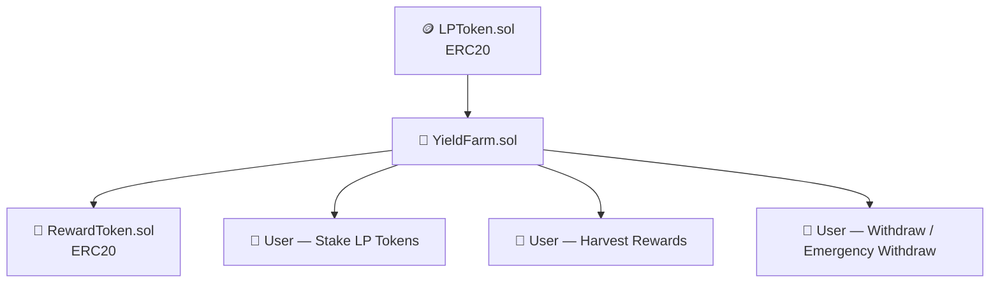
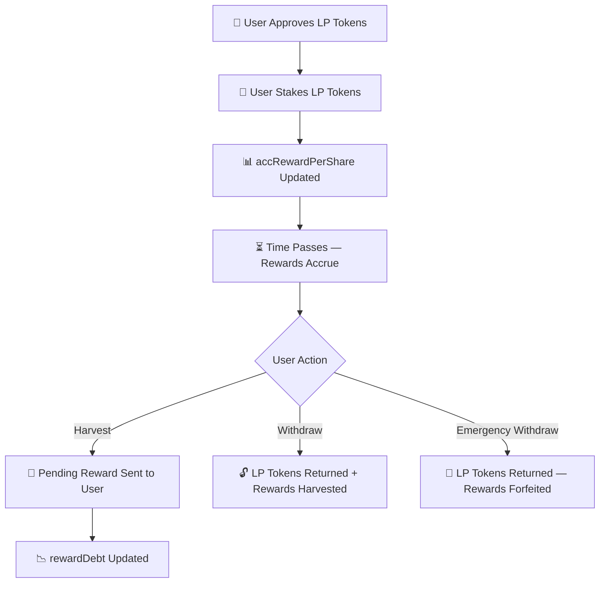

<div align="center">

# 🌾 Yield Farming Platform


<br/>


<br/>

> **A decentralized yield farming protocol where users stake LP tokens and earn FARM rewards, distributed through a gas-efficient `accRewardPerShare` reward accounting model.**

</div>

---

## 📑 Table of Contents

- [Overview](#-overview)
- [Project Status](#-project-status)
- [Live Deployment](#-live-deployment-sepolia)
- [Reward Distribution Mechanics](#-reward-distribution-mechanics)
- [Features](#-features)
- [Tech Stack](#-tech-stack)
- [Contract Architecture](#-contract-architecture)
- [Protocol Flow](#-protocol-flow)
- [Security Model](#-security-model)
- [Project Structure](#-project-structure)
- [Getting Started](#-getting-started)
- [Testing](#-testing)
- [Deployment](#-deployment)
- [What I Learned](#-what-i-learned)
- [Future Improvements](#-future-improvements)
- [Author](#-author)

---

## 📖 Overview

**Yield Farming Platform** is a decentralized staking protocol built entirely in Solidity. Users stake ERC20 LP (Liquidity Provider) tokens into the farm and earn FARM reward tokens over time, proportional to their share of the pool and the duration of their stake.

Reward distribution is powered by the **`accRewardPerShare` / `rewardDebt`** accounting pattern — the same mechanism used by production DeFi protocols such as SushiSwap's MasterChef. This design allows rewards to be calculated for every user in constant time, without ever needing to loop over stakers, making the protocol scalable and gas efficient regardless of how many participants join the pool.

This is not a tutorial project — it models real staking/farming mechanics from first principles, with custom errors, full event logging, and a comprehensive unit test suite, deployed and interacted with live on Sepolia.

---

## 🚧 Project Status

✅ **Completed**

Fully implemented, unit tested, deployed, and interacted with on the **Ethereum Sepolia Testnet**.

---

## 🌐 Live Deployment (Sepolia)

| Contract | Address |
|---|---|
| **LPToken** | `0x073e36c862C7cD433FdB404760C2250D02B9284e` |
| **RewardToken** | `0xDC298ca25C7e3170E1e3f845D9e9A4ac33B67b8e` |
| **YieldFarm** | `0x4f341b8CBa11A723190a1607D4dCC9f6eD73d180` |

**Network:** Ethereum Sepolia Testnet

---

## ⚙️ Reward Distribution Mechanics

### accRewardPerShare
Tracks the cumulative reward earned per LP token staked, updated on every pool interaction (stake, withdraw, or harvest).

```
accRewardPerShare += (rewardsSinceLastUpdate × PRECISION) / totalStaked
```

### rewardDebt
Tracks the portion of `accRewardPerShare` already accounted for a given user, ensuring they can only claim rewards accrued **after** their last interaction — preventing double-claiming.

```
rewardDebt = userStakedAmount × accRewardPerShare / PRECISION
```

### Pending Reward Calculation
A user's claimable reward at any point in time is computed as:

```
Pending Reward = (userStakedAmount × accRewardPerShare / PRECISION) − userRewardDebt
```

This O(1) design means adding new stakers never increases the gas cost of reward calculations for existing users.

---

## ✨ Features

| Feature | Description |
|---|---|
| 🌱 Stake LP Tokens | Deposit LP tokens into the farm to start earning |
| 🌾 Earn FARM Rewards | Accrue reward tokens proportional to stake and time |
| 🌿 Harvest Rewards | Claim accumulated rewards without unstaking |
| 🔓 Withdraw | Unstake LP tokens and withdraw at any time |
| 🚨 Emergency Withdraw | Exit the pool immediately, forfeiting pending rewards |
| 📊 Pending Reward Calculation | View-only function to preview unclaimed rewards |
| ⚡ Efficient Reward Accounting | O(1) reward updates using `accRewardPerShare` |
| 🛡️ Custom Errors | Gas-efficient reverts instead of require strings |
| 📢 Event Logging | Full on-chain event trail for staking, harvesting, withdrawals |
| 🧪 Unit Tested | Comprehensive Hardhat/Chai test suite |
| 🌐 Sepolia Deployment | Deployed and verified on Ethereum Sepolia testnet |

---

## 🛠 Tech Stack

| Layer | Technologies |
|---|---|
| **Smart Contracts** | Solidity ^0.8.20 |
| **Development Framework** | Hardhat 3, TypeScript |
| **Token Standard** | ERC20 (OpenZeppelin) |
| **Testing** | Mocha, Chai |
| **Web3 Library** | Ethers.js v6 |
| **Deployment** | Hardhat Ignition, Sepolia Testnet |

---

## 🏗 Contract Architecture



### Contract Responsibilities

| Contract | Role |
|---|---|
| `YieldFarm.sol` | Core protocol — staking, reward accounting, harvesting, withdrawals |
| `LPToken.sol` | ERC20 token representing LP shares that users stake |
| `RewardToken.sol` | ERC20 token distributed to stakers as farming rewards |

---

## 🔄 Protocol Flow



---

## 🔒 Security Model

| Mechanism | Purpose |
|---|---|
| `accRewardPerShare` / `rewardDebt` accounting | Prevents double-claiming and ensures fair, proportional reward distribution |
| Custom Errors | Gas-efficient reverts instead of string-based `require` statements |
| Event Logging | Full audit trail for staking, harvesting, and withdrawal actions |
| Emergency Withdraw | Lets users exit and recover principal even if reward logic is paused or broken |
| OpenZeppelin ERC20 | Battle-tested, audited base for both LPToken and RewardToken |
| CEI Pattern | Checks-Effects-Interactions ordering to guard against reentrancy |

---

## 📁 Project Structure

```bash
yield_farming_platform/
│
├── contracts/
│   ├── LPToken.sol           # ERC20 token representing LP shares
│   ├── RewardToken.sol       # ERC20 token distributed as farming rewards
│   └── YieldFarm.sol         # Core staking & reward distribution logic
│
├── ignition/
│   └── modules/
│       └── Deploy.ts         # Hardhat Ignition deployment module
│
├── scripts/
│   └── interact.ts           # Post-deployment interaction script
│
├── test/
│   └── YieldFarm.ts          # Full test suite
│
├── hardhat.config.ts
├── package.json
└── .env
```

---

## 🚀 Getting Started

### Prerequisites
- Node.js (v18+)
- A Sepolia RPC URL (Alchemy / Infura)
- A funded Sepolia wallet

### Installation

```bash
git clone https://github.com/Jeevan9898/yield_farming_platform.git
cd yield_farming_platform
npm install
```

### Environment Variables

Create a `.env` file in the project root:

```env
SEPOLIA_RPC_URL=your_sepolia_rpc_url
PRIVATE_KEY=your_wallet_private_key
ETHERSCAN_API_KEY=your_etherscan_api_key
```

### Compile

```bash
npx hardhat compile
```

---

## 🧪 Testing

```bash
npx hardhat test
```

Tests cover:

- Contract deployment (LPToken, RewardToken, YieldFarm)
- Funding the yield farm with reward tokens
- Staking LP tokens
- Pending reward calculation
- Harvesting rewards
- Withdrawing staked LP tokens
- Emergency withdrawals

---

## 🌐 Deployment

### Deploy to Sepolia

```bash
npx hardhat ignition deploy ignition/modules/Deploy.ts --network sepolia
```

### Interact with Deployed Protocol

```bash
npx hardhat run scripts/interact.ts --network sepolia
```

The script demonstrates:
- Funding the Yield Farm
- Approving LP Tokens
- Staking LP Tokens
- Viewing Pending Rewards
- Displaying User Balances

---

## 📚 What I Learned

- Solidity Smart Contract Development
- ERC20 Token Standards and inter-contract token flows
- Gas-efficient reward accounting design (`accRewardPerShare` pattern)
- Preventing double-claiming with `rewardDebt`
- Custom Errors and event-driven contract design
- Hardhat testing with Mocha and Chai
- Hardhat Ignition deployment modules
- Ethereum Sepolia Testnet deployment and interaction

---

## 🔮 Future Improvements

- [ ] Multiple Farming Pools
- [ ] Dynamic Reward Rates
- [ ] Lock-up Periods
- [ ] Bonus Reward Multipliers
- [ ] DAO Governance
- [ ] Frontend Dashboard
- [ ] Time-Based Reward Weighting
- [ ] Pool Fee Distribution
- [ ] Auto-Compounding
- [ ] Additional Reentrancy Protection & Access Control

---

## 📄 License

This project is licensed under the **MIT License**.

---

## 👤 Author

**Jeevan Yadav**

[](https://jeevan-yadav.vercel.app/)
[](https://github.com/Jeevan9898)
[](https://www.linkedin.com/in/jeevan-yadav-b664952b5)

---


